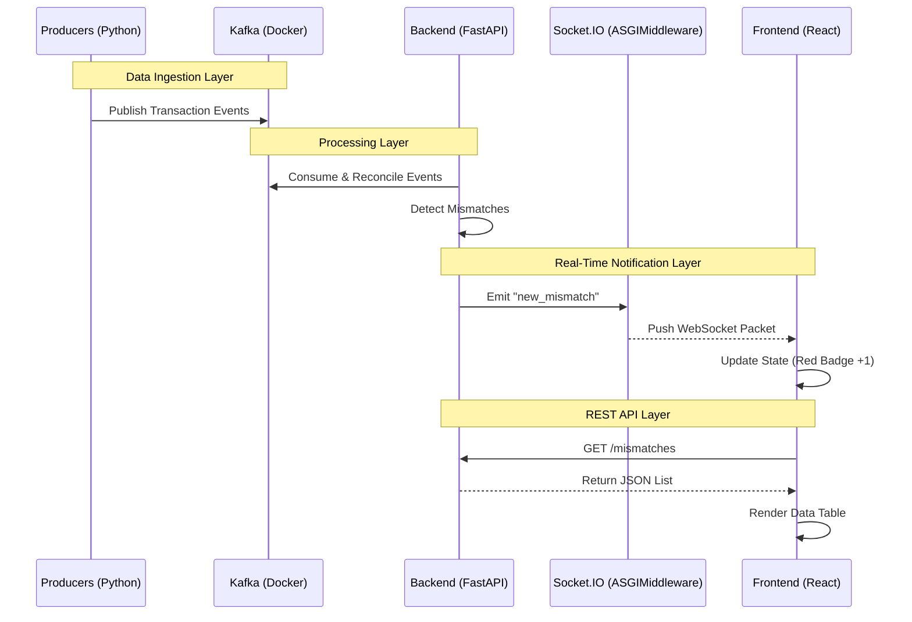

# 📂 Project Structure & Architecture

This document provides a detailed map of the **Real-Time Transaction Reconciliation Engine**, explaining the file organization and how the Frontend, Backend, and Data Streaming layers interconnect.

---

## 🌳 Directory Tree

```
Reconciliation-Engine/
├── 📂 backend/                     # FastAPI Backend Server
│   ├── 📂 app/
│   │   ├── 📂 routers/
│   │   │   ├── mismatches_router.py  # API endpoints for mismatches
│   │   │   └── transactions_router.py# API endpoints for transactions
│   │   ├── 📂 schemas/             # Pydantic models for request/response validation
│   │   ├── 📂 utils/
│   │   │   └── socket_manager.py     # Socket.IO server implementation
│   │   └── main.py                   # App entry point (CORS, Routes, Socket Mount)
│   ├── requirements.txt            # Python dependencies (FastAPI, Uvicorn, etc.)
│   └── venv/                       # Python Virtual Environment
│
├── 📂 frontend/                    # React Frontend
│   ├── 📂 public/                  # Static assets (images, favicon)
│   ├── 📂 src/
│   │   ├── 📂 components/
│   │   │   ├── 📂 common/          # Reusable UI (Loader, ErrorBoundary, Toast)
│   │   │   ├── 📂 dashboard/       # Charts, Stats Cards, Activity Feed
│   │   │   └── 📂 layout/          # Sidebar, Header, Main Layout
│   │   ├── 📂 context/             # AuthContext (State Management)
│   │   ├── 📂 hooks/               # Custom Hooks (useSocket, useApi, useAuth)
│   │   ├── 📂 pages/               # Route Views (Dashboard, Transactions, Mismatches)
│   │   ├── 📂 services/            # Ext. Communication (API Axios, Socket.IO Client)
│   │   ├── 📂 styles/              # Global CSS & Tailwind layers
│   │   ├── 📂 utils/               # Helpers & Constants
│   │   ├── App.jsx                 # Route Defs & Context Providers
│   │   └── main.jsx                # React Entry Point
│   ├── .env                        # Environment Variables (API URLs)
│   ├── package.json                # JS Dependencies
│   ├── tailwind.config.js          # Design System Config
│   └── vite.config.js              # Build & Proxy Config
│
├── 📂 kafka/                       # Infrastructure
│   ├── 📂 schemas/                 # Avro Schemas
│   ├── docker-compose.yml          # Kafka, Zookeeper, Registry setup
│   └── register_schema.py          # Script to register Avro schemas
│
├── 📂 producers/                   # Data Simulation
│   ├── core_producer.py            # Simulates Core Banking transactions
│   ├── gateway_producer.py         # Simulates Payment Gateway transactions
│   ├── mobile_producer.py          # Simulates Mobile App transactions
│   └── utils.py                    # Shared generation logic
│
├── .gitignore                      # Git exclusion rules
└── README.md                       # Project documentation
```

---

## 🔗 System Interconnections

### 1. **Real-Time Data Pipeline** (Producers → Backend)
*   **Source**: Files in `producers/*.py` generate fake financial transactions.
*   **Transport**: They publish messages to **Kafka Topics** (`core_txns`, `gateway_txns`, `mobile_txns`) defined in `kafka/docker-compose.yml`.
*   **Ingestion**: The Backend (`backend/app/main.py`) will eventually use a **Kafka Consumer** (via `confluent-kafka`) to read these messages.

### 2. **API Communication** (Frontend ↔ Backend)
*   **Request**: 
    1.  User loads **Dashboard** (`frontend/src/pages/Dashboard.jsx`).
    2.  Component calls custom hook `useApi`.
    3.  `useApi` uses `frontend/src/services/api.js` (Axios).
    4.  Axios sends HTTP GET to `http://localhost:8000/transactions/`.
*   **Response**: 
    1.  **FastAPI** (`backend/app/main.py`) receives request.
    2.  Routes it to `backend/app/routers/transactions_router.py`.
    3.  Router returns JSON data.
    4.  React component renders the data in the table.

### 3. **Real-Time Updates** (Backend ↔ Frontend)
*   **Trigger**: A new mismatch is detected or a transaction arrives at the Backend.
*   **Backend Emit**:
    *   `backend/app/routers/transactions_router.py` imports `socket_manager`.
    *   Calls `await socket_manager.emit_transaction(data)`.
    *   Server pushes event `new_transaction` via WebSocket.
*   **Frontend Listen**:
    *   `frontend/src/services/socket.js` is listening for `new_transaction`.
    *   `frontend/src/hooks/useSocket.js` triggers a callback.
    *   **React State** updates, refreshing the **RealtimeChart** automatically.

### 4. **Authentication Flow** (User ↔ Mock Auth ↔ App)
*   **Login**: 
    *   User clicks "Login" in Frontend.
    *   `frontend/src/services/auth.js` uses **Mock Authentication**.
*   **Token**: 
    *   Mock auth returns a **Mock JWT Token**.
    *   Frontend stores this token in memory/context.
*   **Authorization**: 
    *   Every API call in `services/api.js` automatically attaches the token: `Authorization: Bearer <token>`.
    *   Backend validates this token (future implementation) before serving data.

---

## 🧩 Key Files Explained

| File | Layer | Purpose |
|------|-------|---------|
| `backend/app/main.py` | Backend | The "Brain" of the API. Sets up CORS to allow Frontend access and mounts the Socket.IO server. |
| `backend/app/utils/socket_manager.py` | Backend | Manages WebSocket connections. Handles clients joining/leaving and emitting messages to the frontend. |
| `frontend/src/services/api.js` | Frontend | Centralized Axios instance. Handles all HTTP calls, auto-injects Auth tokens, and manages global error states. |
| `frontend/src/services/socket.js` | Frontend | Singleton Socket client. Ensures only ONE socket connection exists even if React re-renders multiple times. |
| `frontend/src/context/AuthContext.jsx` | Frontend | Global state provider. Allows any component in the app to know "Is the user logged in?" and "What is their name?". |
| `kafka/docker-compose.yml` | Infra | Infrastructure-as-Code. Spins up the message broker (Kafka) and Schema Registry needed for the data pipeline. |
| `producers/utils.py` | Data | Shared logic for generating realistic transaction data (random IDs, amounts, timestamps) used by all producers. |

---

## 🔄 Interaction Diagram


