# 🚀 Real-Time Transaction Reconciliation Engine

**A production-grade, bank-level mismatch detection system using Kafka, FastAPI, Redis, PostgreSQL, Keycloak & React.**

---

## 📌 Overview

Banks face reconciliation issues when transactions flowing through multiple systems (Core Banking, Payment Gateway, Mobile App) do not match due to delays, failures, or inconsistencies.

**This project simulates a real-time reconciliation system that:**
* **Ingests** live transaction events from three sources.
* **Detects mismatches** (amount, status, timestamp, missing entries).
* **Stores results** securely in a database.
* **Logs every action** for compliance.
* **Updates a dashboard** in real-time.

> **⚠️ Note:** Even though no real payments occur, the architecture is built exactly like a real bank system using modern enterprise-grade components.

---

## 🏗 System Architecture

The system uses an Event-Driven Architecture (EDA) to ingest and process transactions securely.

```mermaid
graph TD
    %% Warning
    WARNING["⚠️ NO REAL USERS MAKE REAL PAYMENTS - Events are simulated"]
    style WARNING fill:#ffcccc,stroke:#ff0000,color:#000

    %% Producer Layer
    subgraph PROD["🎭 PRODUCER SCRIPTS"]
        CORE["core_producer.py"]
        GATEWAY["gateway_producer.py"] 
        MOBILE["mobile_producer.py"]
    end

    %% Schema & Kafka
    SR["📋 Schema Registry<br/>(Avro)"]
    KAFKA["📨 Apache Kafka<br/>(Message Bus)"]

    %% Security
    KC["🔐 Keycloak<br/>(OAuth2 + JWT)"]

    %% Backend Processing
    API["⚙️ FastAPI Backend<br/>(Reconciliation Engine)"]

    %% Storage
    REDIS[("💾 Redis<br/>(Temp State)")]
    PG[("💾 PostgreSQL<br/>(Results & Audit)")]

    %% Frontend
    DASH["🖥️ React Dashboard"]

    %% Flow
    WARNING -.-> PROD
    CORE -->|core_txns| KAFKA
    GATEWAY -->|gateway_txns| KAFKA
    MOBILE -->|mobile_txns| KAFKA
    
    SR -.->|Schema Validation| KAFKA
    KAFKA -->|Consumer| API
    
    API <-->|Temp Storage| REDIS
    API -->|Store Results| PG
    
    DASH -->|Login| KC
    KC -->|JWT| DASH
    DASH -->|HTTPS + JWT| API
    API -->|Socket.IO| DASH

    %% Styling
    classDef producer fill:#e1f5fe,stroke:#0277bd
    classDef infra fill:#fff3e0,stroke:#ef6c00
    classDef security fill:#f3e5f5,stroke:#7b1fa2
    classDef backend fill:#e8f5e8,stroke:#2e7d32
    classDef storage fill:#fce4ec,stroke:#c2185b
    classDef frontend fill:#e3f2fd,stroke:#1976d2

    class CORE,GATEWAY,MOBILE producer
    class SR,KAFKA infra
    class KC security
    class API backend
    class REDIS,PG storage
    class DASH frontend
```

### 🔄 Data Flow Breakdown

**1. PRODUCER SCRIPTS (SIMULATION)**
- `core_producer.py` → Kafka topic: `core_txns`
- `gateway_producer.py` → Kafka topic: `gateway_txns`  
- `mobile_producer.py` → Kafka topic: `mobile_txns`
- Pretend to be real banking systems
- Create random transaction events
- Inject mismatches intentionally

**2. SCHEMA REGISTRY (Avro)**
- Enforces strict schema for all producers
- Prevents malformed/corrupted data
- Guarantees consistent transaction structure

**3. KAFKA (Message Bus)**
- Stores events from all 3 sources
- Guarantees durability, ordering & no data loss
- TLS secured communication (Producers ↔ Kafka ↔ Backend)

**4. AUTHENTICATION + AUTHORIZATION (KEYCLOAK)**
- Provides OAuth2 + JWT
- Provides login UI for Dashboard
- Implements RBAC (admin, viewer roles)
- Protects backend API endpoints
- Backend verifies JWT on every request

**5. RECONCILIATION ENGINE (FastAPI Backend)**
1. Kafka Consumer reads events (TLS secure)
2. Keycloak auth validates JWT
3. Optional schema validation
4. Temporary event state stored in Redis
5. When ≥2 sources → perform reconciliation:
   - Amount mismatch
   - Status mismatch
   - Timestamp mismatch
   - Missing event from core/gateway/mobile
6. Store results in PostgreSQL
7. Create audit log entry
8. Emit real-time update to dashboard via Socket.IO

**6. DATABASES (PostgreSQL + Redis)**
- **PostgreSQL** (Encrypted at-rest optional):
  - `raw_events` table
  - `reconciliation_results` table
  - `audit_logs` table (who accessed what & when)
- **Redis**: Temporary in-flight event storage

**7. REACT DASHBOARD**
- User logs in via Keycloak login screen
- Receives JWT token
- Uses HTTPS (TLS) to call backend APIs
- Listens to Socket.IO for real-time mismatches
- Displays results, charts, summaries & audit logs

---

## 🛠 Technology Stack

| Component | Technology | Role |
|-----------|------------|------|
| Backend | FastAPI (Python) | High-performance API & reconciliation logic |
| Frontend | React.js | Interactive dashboard for operations |
| Streaming | Apache Kafka | Real-time event ingestion & buffering |
| Cache | Redis | Temporary in-flight event state storage |
| Database | PostgreSQL | Permanent storage for results & audit logs |
| Auth | Keycloak | IAM, OAuth2, and Role-Based Access Control |
| Real-Time | Socket.IO | Push updates to frontend |

---

## 🔍 Core Features

✔ **Real-time Ingestion**: Three producer scripts simulate live banking systems.

✔ **Strict Schema Validation**: Ensures every transaction follows identical structure (Avro).

✔ **Enterprise-Grade Security**:
- Keycloak (OAuth2 + JWT)
- Role-based access (admin/viewer)
- TLS encryption for all communication

✔ **Real-time Reconciliation**: Detects mismatches instantly when ≥2 sources are available.

✔ **Live Dashboard**: Socket.IO updates → no page refresh needed.

✔ **Full Auditing**: Logs who accessed what and when (critical bank requirement).